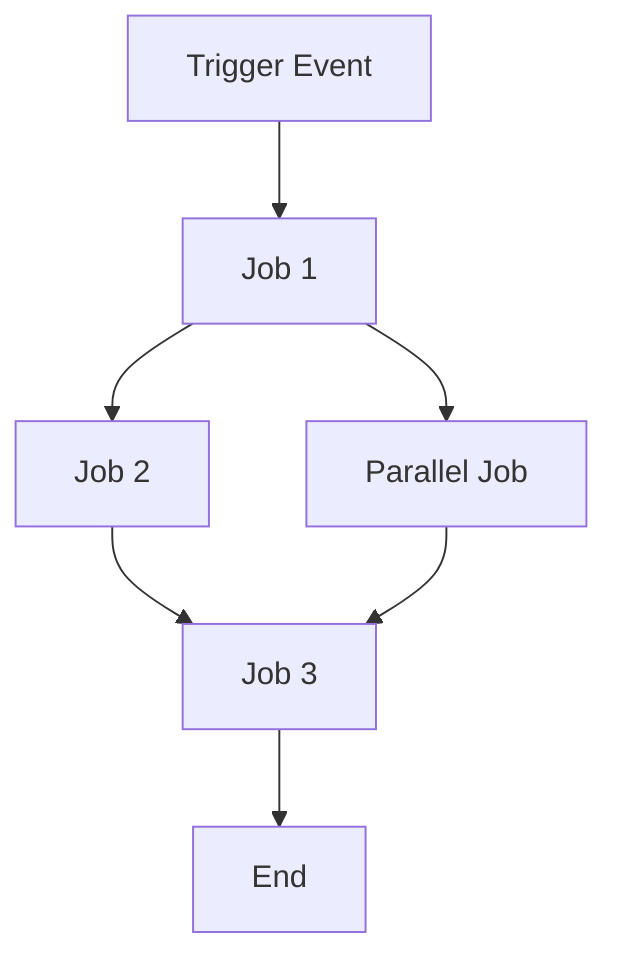

# Create GitHub Actions Workflow Specification

Create a comprehensive specification for the GitHub Actions workflow: `${input:WorkflowFile}`.

This specification serves as a specification for the workflow's behavior, requirements, and constraints. It must be implementation-agnostic, focusing on **what** the workflow accomplishes rather than **how** it's implemented.

## AI-Optimized Requirements

- **Token Efficiency**: Use concise language without sacrificing clarity
- **Structured Data**: Leverage tables, lists, and diagrams for dense information
- **Semantic Clarity**: Use precise terminology consistently throughout
- **Implementation Abstraction**: Avoid specific syntax, commands, or tool versions
- **Maintainability**: Design for easy updates as workflow evolves

## Specification Template

Save as:
`/spec/spec-process-cicd-[workflow-name].md`

```md
---
title: CI/CD Workflow Specification - [Workflow Name]
version: 1.0
date_created: [YYYY-MM-DD]
last_updated: [YYYY-MM-DD]
owner: DevOps Team
tags: [process, cicd, github-actions, automation, [domain-specific-tags]]
---

## Workflow Overview

**Purpose**: [One sentence describing workflow's primary goal]
**Trigger Events**: [List trigger conditions]
**Target Environments**: [Environment scope]

## Execution Flow
Diagram


```

## Jobs & Dependencies

| Job Name | Purpose | Dependencies | Execution Context |
|----------|---------|--------------|-------------------|
| job-1 | [Purpose] | [Prerequisites] | [Runner/Environment] |
| job-2 | [Purpose] | job-1 | [Runner/Environment] |

## Requirements

### Functional Requirements
| ID | Requirement | Priority | Acceptance Criteria |
|----|-------------|----------|-------------------|
| REQ-001 | [Requirement] | High | [Testable criteria] |

### Security Requirements
| ID | Requirement | Implementation Constraint |
|----|-------------|---------------------------|
| SEC-001 | [Security requirement] | [Constraint description] |

### Performance Requirements
| ID | Metric | Target | Measurement Method |
|----|-------|--------|-------------------|
| PERF-001 | [Metric] | [Target value] | [How measured] |

## Input/Output

### Inputs

```yaml
# Environment Variables
ENV_VAR_1: string  # Purpose: [description]
ENV_VAR_2: secret  # Purpose: [description]

# Repository Triggers
paths: [list of path filters]
branches: [list of branch patterns]
```

### Outputs

```yaml
# Job Outputs
job_1_output: string  # Description: [purpose]
build_artifact: file  # Description: [content type]
```

## Error Handling Strategy

| Error Type | Response | Recovery Action |
|------------|----------|-----------------|
| Build Failure | [Response] | [Recovery steps] |
| Test Failure | [Response] | [Recovery steps] |
| Deployment Failure | [Response] | [Recovery steps] |

## Quality Gates

### Gate Definitions

| Gate | Criteria | Bypass Conditions |
|------|----------|-------------------|
| Code Quality | [Standards] | [When allowed] |
| Security Scan | [Thresholds] | [When allowed] |
| Test Coverage | [Percentage] | [When allowed] |

## Monitoring & Observability

### Key Metrics
- **Success Rate**: [Target percentage]
- **Execution Time**: [Target duration]
- **Resource Usage**: [Monitoring approach]

## Change Management

1. **Specification Update**: Modify this document first
2. **Review & Approval**: [Approval process]
3. **Implementation**: Apply changes to workflow
4. **Testing**: [Validation approach]
5. **Deployment**: [Release process]

## Validation Criteria

### Workflow Validation
- **VLD-001**: [Validation rule]

### Performance Benchmarks
- **PERF-001**: [Benchmark criteria]

---
